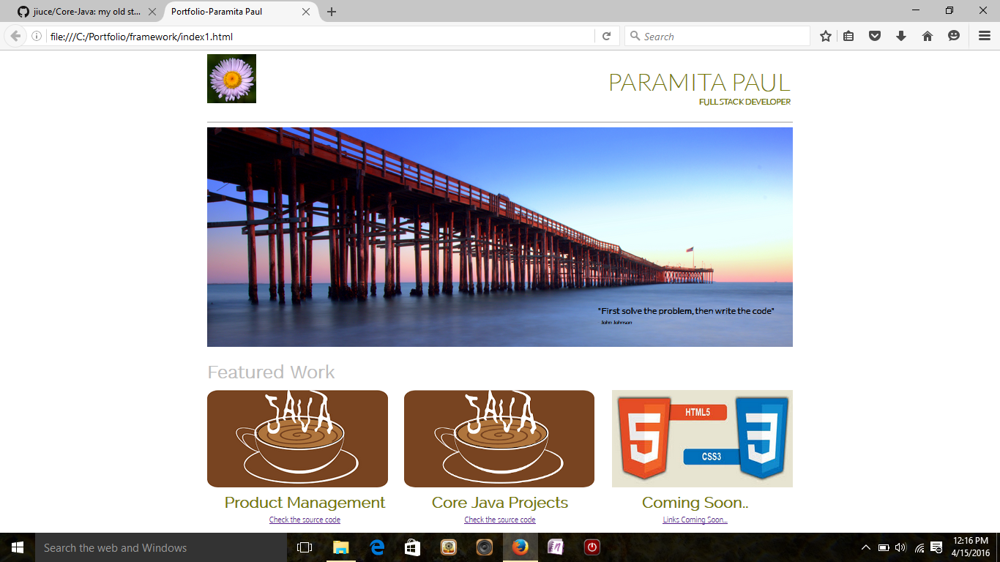

# My Projects

The Portfolio Screenshot:

###Product Management
It is a web based Java Project. The UI is developed using HTML, CSS and JSP.
All the user requests are handled by Servlets, created for all operations. 
The operations that can be performed are Adding Products, Deleting, View All Products in DB, Updating the Prices.
I have used MYSQL as the database and JDBC for the connectivity.

###Core Java Projects
The link takes to the list of following projects :

1. Programs on Java File Input Output
2. Programs to Read/Parse XML files, Create XML from Database
3. Regex and Thread Programs

###J2EE projects:
####HealthCareApp
    Legacy project, where Struts and Spring are integrated to work together. Struts used to provide structure to the project in its own ModelViewController mode. Spring is only used to take advantage of its easy integration techniques with the Database.
####SpringIOC
    Integrating Spring with Database using HibernateTemplate, JDBC Template.
####JPA1
  Small programns implementing all JPA/Hibernate mapping relationships
####MyProjectBasicDataSource
    Spring connected to MYSQL using BasicDataSource
    

